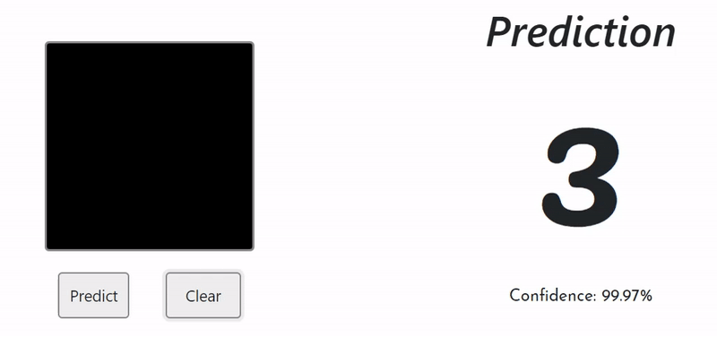

# Digital Digits

A digit recognition web application using Convolution Neural Network to predict hand-drawn digits in real time.

### Live : [https://digit-al.herokuapp.com](https://digit-al.herokuapp.com)

### Technologies used:

+ HTML5 
+ CSS3
+ Javascript
+ Node.js
+ Python
+ Tensorflow.js
+ Keras
+ Express
+ Heroku

### License
Distributed under the MIT License.
